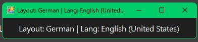
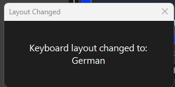

# Keyboard Layout Watcher

A Windows application that monitors and displays the current keyboard layout. Shows an alert when the keyboard layout changes.




## Features

- Detects keyboard layout changes in real-time
- Works even when the application is not focused
- Shows a popup alert when the layout changes
- Dark themed UI
- Supports common keyboard layouts (US, German, UK, French, Spanish, and many more)

## Requirements

- Windows
- .NET Framework 4.7.2

## Building

Run `build.bat` to compile the project. The executable will be created at:

```
KeyboardLayoutWatcher\bin\Release\KeyboardLayoutWatcher.exe
```

Alternatively, open `KeyboardLayoutWatcher.sln` in Visual Studio and build from there.

## Usage

1. Run `KeyboardLayoutWatcher.exe`
2. The main window displays the current keyboard layout
3. When you change the keyboard layout (via Windows system tray or keyboard shortcut), a popup alert appears
4. Close the alert with Enter, Escape, or click OK

## Supported Layouts

- US, UK, German, French, Italian, Spanish
- Portuguese (Brazil/Portugal), Canadian French
- Dutch, Swedish, Norwegian, Finnish, Danish
- Polish, Czech, Slovak, Hungarian, Romanian, Bulgarian
- Russian, Ukrainian, Greek, Turkish
- Hebrew, Arabic
- Japanese, Korean, Chinese (Traditional/Simplified)

Unknown layouts will display the raw keyboard layout ID.
